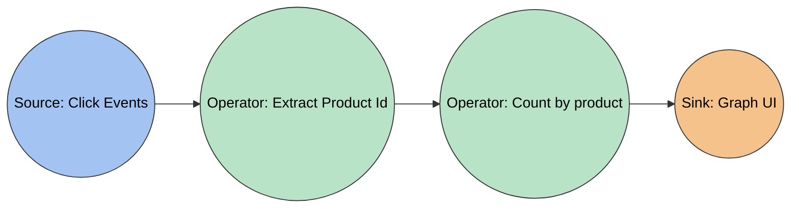
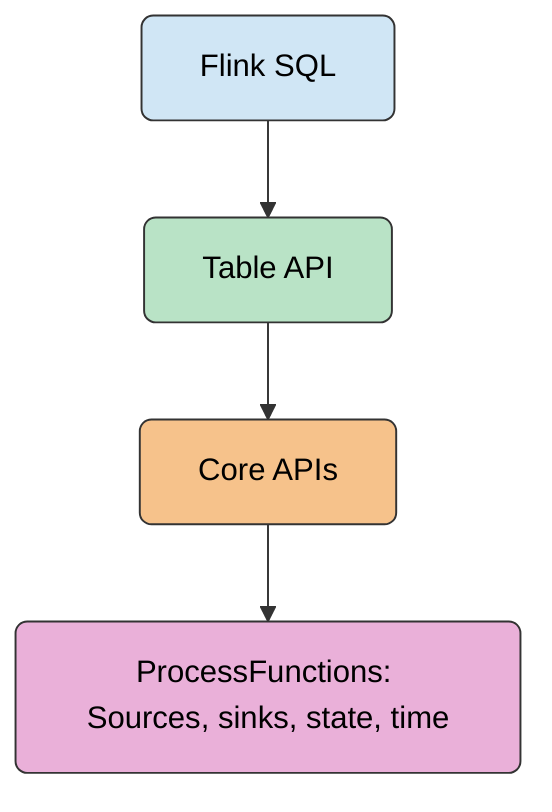

# Apache Flink - First principles notes

---

## What Flink is

- A distributed system and engine for stateful big data streaming
  - distributed system i.e it runs on a cluster
  - engine - it can run any kind of computation
  - stateful - can keep and update internal information while data is being processed
  - big data - can scale beyond what fits on a standard computer
  - streaming - can process an unbounded amount of data as it arrives

---

## Context of Big Data

- Computing vs data
  - CPUs are only incrementally faster
  - Data storage keeps getting better and cheaper
  - gathering data keeps getting easier and cheaper and more important
- Data needs to be distributed and processed in parallel
- Standard single-CPU software cannot scale up
- Frameworks exist
  - Batch processing (e.g. MapReduce, Spark)

---

## Context of Data Streaming

- Data synchronisation with warehouses is not easy
  - Need to rerun computations on the entire data
- Results need to be updated along with the data
  - Incremental pipelines and micro-batches have unacceptable latency
- Need to provide data guarantees
  - distributed systems are inherently unreliable
- Need to run arbitrary computations on incoming data
  - SQL is not general enough
  - need to keep internal information (state) as new data arrives

- Flink can be considered a solution to these problems.

---

## How flink helps / solves these

- Distribution and Scalability
  - Flink can scale out to thousands of machines and process an unbounded amount of data
- Real-time results
  - Flink provides very low latency
- Strong data consistency
  - Flink can be controlled to offer exactly-once guarantees
- Stateful, arbitrary computation
  - Flink can run any code as soon as a new element of data arrives
  - Flink can keep internal information (state) as data is being processed

---

## Main flink features

- Event-time and processing time
  - Dealing with data elements in the time they were created or processed
- Low latency, high throughput
  - Excellent solutions to latency vs throughput tradeoffs, millisecond latency, can handle millions of event/s
- Exactly-once consistency guarantees
  - Also configurable for at-least-once, at-most-once
- Connectors to everything popular
  - Kafka, Cassandra, JDBC, ES, HDFS, S3, Pulsar etc
- Layer simple to use APIs
  - High control vs ease of use
- Other features
  - High availability, integration with Kubernetes, YARN, Mesos, dynamic scaling
  - Easy to update applications without losing state

---

## Use cases

- Event-driven applications
  - react to data elements as events: trigger computations, external actions, updates etc.
  - examples:
    - recommendation systems
    - fraud detection
    - alerting and monitoring
- Low-latency data pipelines
  - transform / enrich / transport data as it arrives
  - much lower latency that regular ETL scheduled jobs
  - example: real-time data aggregation, e.g search indices
- Real-time data analytics
  - process data, extract insights and make decisions as soon as new data arrives
  - examples
    - data-driven business decisions
    - IoT applications
    - measuring data from consumer applications

---

## Comparisons

- Spark
  - Flink is better for low-latency, stateful, arbitrary computations
  - Spark is better suited to (micro) batch processing. I.e it is still a batch processing framework
- Kafka
  - Flink is better for data analytics and data aggregation
  - Kafka is better used as a message bus between services
- Bean
  - Flink is more powerful, with more expressive APIs
  - Beam is a general data API, Flink can run as a backend of Beam
- Akka Streams
  - Flink is better for purely data related outcomes
  - Akka Streams is better as a tool to implement reactive services themselves
- Airflow
  - Flink is a data processing engine
  - Airflow is simply a workflow manager, it has no processing capabilities of its own.

---

## Streaming Concepts

- Dataflow = description of data processing steps in the application
  - made of operators
- Operator = an independent logical processing step
  - can be parallelized into tasks
- Task, aka "operator task" is an instance of an operator
  - works on a data partition i.e a portion of the data to be independently processed
  - runs on a physical machine

### Logical Dataflow

### Physical dataflow

- Physical dataflow can be different to logical data flow

---

## Streaming concepts

- Latency vs throughput
  - latency = time between event and result
  - throughput = number of processed events per unit of time (seconds)
  - lowering latency increases throughput
  - higher throughput is possible at the expense of latency (e.g micro batch in Spark)
- Event time vs processing time
  - all events in Flink are timestamped
  - event time = time when the event arrived at the Flink processor
  - choosing event time vs processing time can lead to different results

---

## Flink APIs in terms of expressiveness

