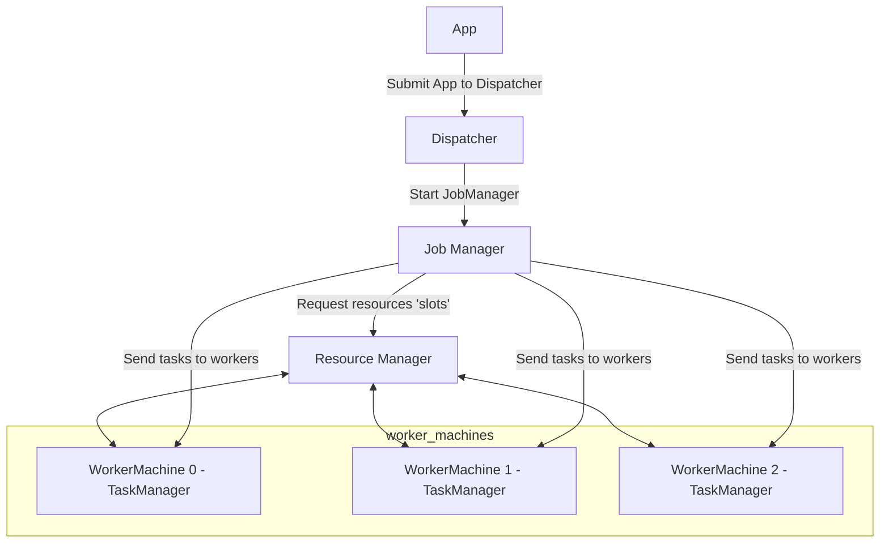

# How Flink runs on a Cluster notes

---

## Flink Setup

- JobManager
  - Controls the execution of one application
  - A single "master" process
- Resource Manger
  - Requests and allocates computing resources
  - Can be run by YARN, Mesos, Kubernetes or Standalone
- TaskMangers
  - Worker processes run tasks
  - Can offer task slots as resources
  - Can communicate with other TaskManagers to run the job correctly
- Dispatcher
  - Single process across multiple job s
  - Spawns a JobManger when an application is submitted
  - Offers a REST API

---

## Submitting an application

- Submit to Dispatcher
- Dispatcher starts JobManager
- JobManger requests resources (slots)
- TaskManagers
  - start
  - register slots to the ResourceManager
  - notifies ResourceManager of slots to be offered
  - Offer slots to JobManager
- JobManager sends tasks to workers

---

## Deployment Modes

- Application Mode
  - Other libraries (JARs) are include with the Flink distribution
  - JobManager and clusters created just for this application and then torn down
  - Best for: bundled job, faster deployment
- Per-job mode
  - Uses the resource provider to create a cluster for this job, then tear it down
  - Created a JobManager per job
  - Best for: isolated, granular resource management
- Session mode
  - a cluster is already present, can submit multiple jobs to the same cluster
  - on JobManger for the entire session
  - jobs compete for the same resources
  - advantage: no resource overhead spinning up cluster for every job/application