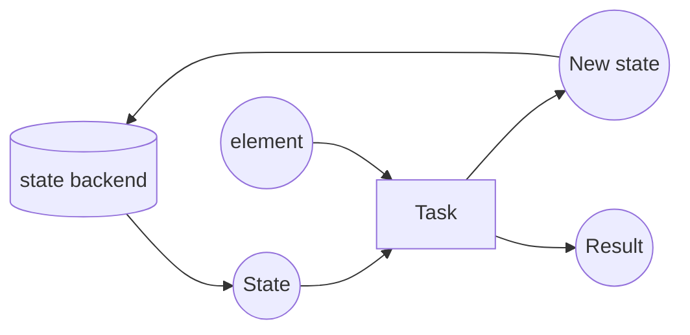

# Stateful Streams Notes

- Flink is effectively a stateful data processing engine

---

## State

- Flink can retain and update information while data is processed

---

## State Mechanics

- Flink needs a state backend to retain it
  - in-memory backend (HashMapStateBackend)
  - file-based backend
  - RocksDB backend
  - (advanced / funzies) custom backend

- State management process
  1) event arrives
  2) fetch state
  3) update state
  4) emit result

---

## State Types

- Operator State
  - Private to an operator task
  - Cannot be read/written by another operator task
- Keyed State
  - One instance per key
- About keys
  - A piece of data that is used to group events
  - multiple events can be assigned to the same key
  - an event can be assigned to a single key
  - examples of keys
    - hash code of a String field of the event
    - a number field of the event, mod 10
    - a numeric event type (enum)

---